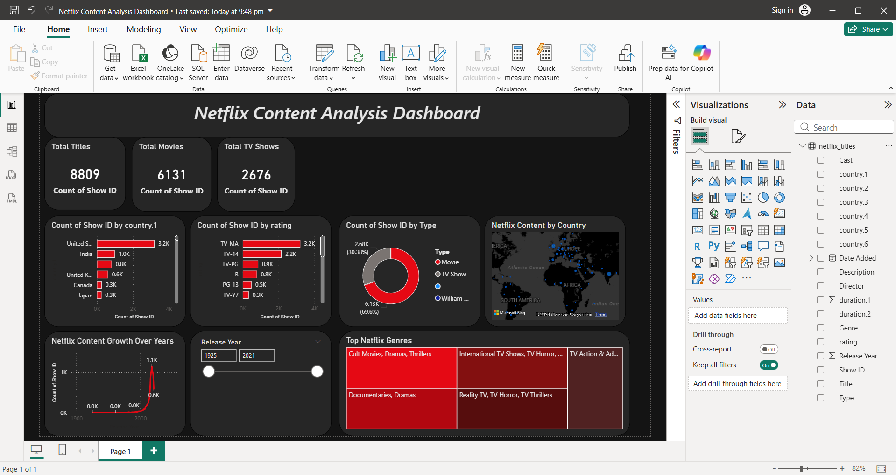

# Netflix-Data-Analysis-PowerBI
An interactive Power BI dashboard analysing 8,800+ Netflix titles with a custom dark-themed UI.

# 🎬 Netflix Content Analysis Dashboard (Power BI)

.

## 📌 Project Overview
Is project mein maine Netflix ke **8,800+ titles** ke dataset ko analyse kiya hai taaki content distribution aur global trends ko samjha ja sake. Maine ek "High-Fidelity" Dark Theme interface design kiya hai jo Netflix ki brand identity se match karta hai.

## 🚀 Key Features
- **Total Titles KPI:** Displays the total count of Movies and TV Shows.
- **Content Growth Trend:** A line chart showing how content additions have spiked over the last decade.
- **Geographical Distribution:** A dark-themed map showing top content-producing countries (USA and India leading).
- **Genre Insights:** A Tree Map filtered for the **Top 5 Genres** to avoid clutter.
- **Content Mix:** A Donut chart highlighting the ratio between Movies and TV Shows.
- **Interactive Slicers:** Filter data based on the **Release Year**.

## 🛠️ Tech Stack & Tools
- **Tool:** Power BI Desktop
- **Data Source:** Kaggle (Netflix Movies and TV Shows dataset)
- **Processes:** - **Power Query:** Data cleaning (handling nulls, splitting genres).
  - **Data Modeling:** Creating relationships and measures.
  - **UI/UX:** Custom dark theme, monochromatic red palette, and consistent alignment.

## 📊 Key Insights Derived
1. **Movie Dominance:** Movies make up approximately **70%** of the total library.
2. **Growth Trend:** There was an exponential increase in content additions starting from **2015**.
3. **Rating Analysis:** **TV-MA** is the most common rating, showing Netflix's focus on mature audiences.
4. **Top Genre:** **International Movies** and **Dramas** are the most produced genres globally.

## 📂 How to View this Project
1. Clone this repository.
2. Open the `.pbix` file using **Power BI Desktop**.
3. (Optional) View the `Netflix_Dashboard.pdf` for a quick look at the final result.

---
**Developed by:** [Shubham Sharma](https://github.com/2005-shubham)  
**Connect with me:** [LinkedIn]((https://www.linkedin.com/in/shubham-sharma-ab1b3b312/)
